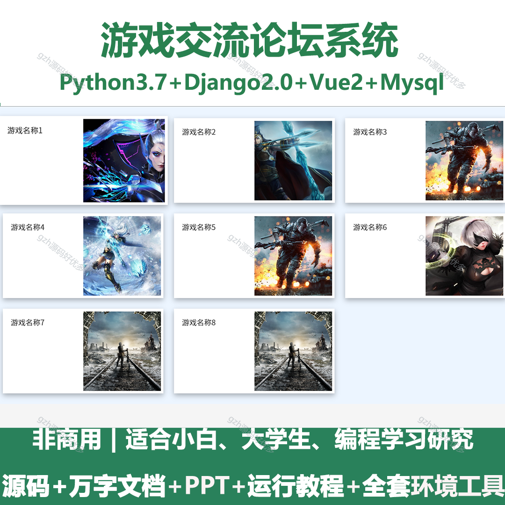
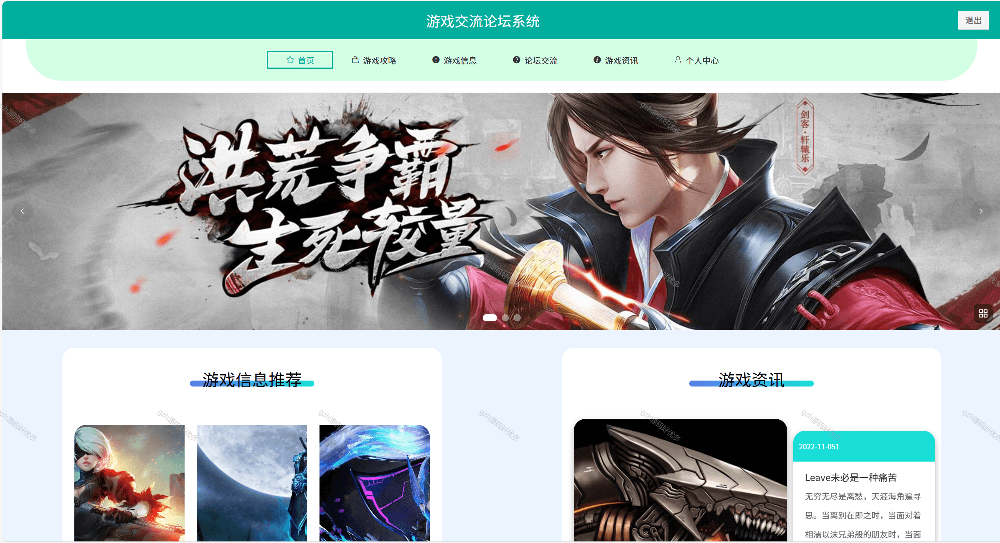
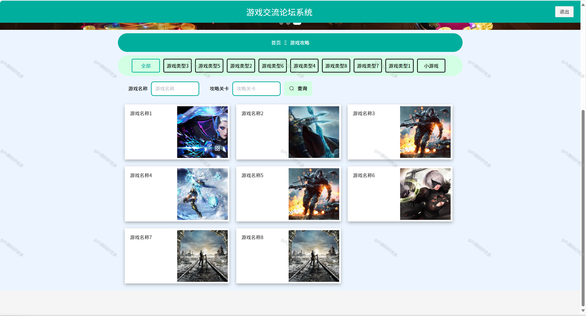
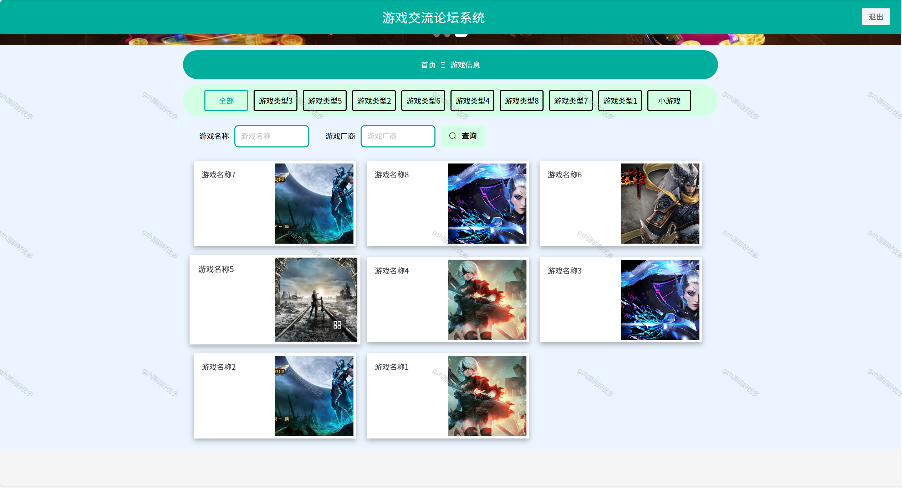
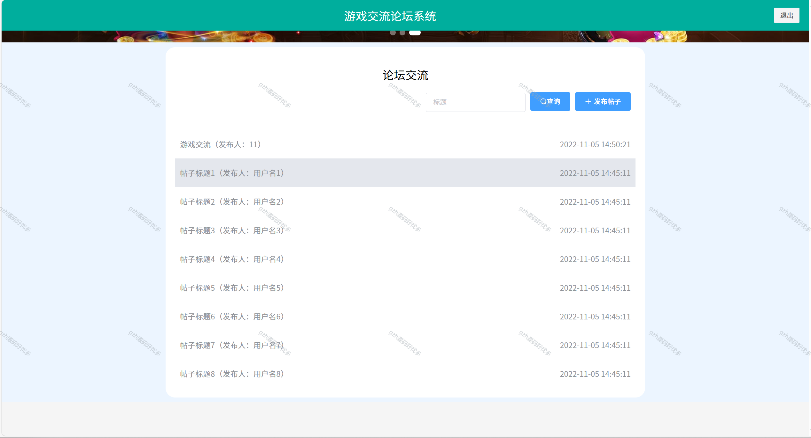
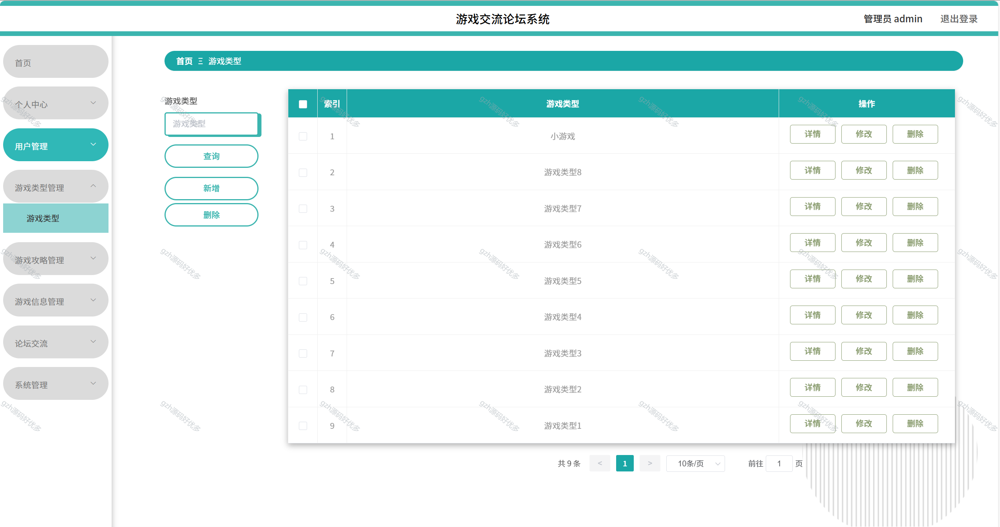
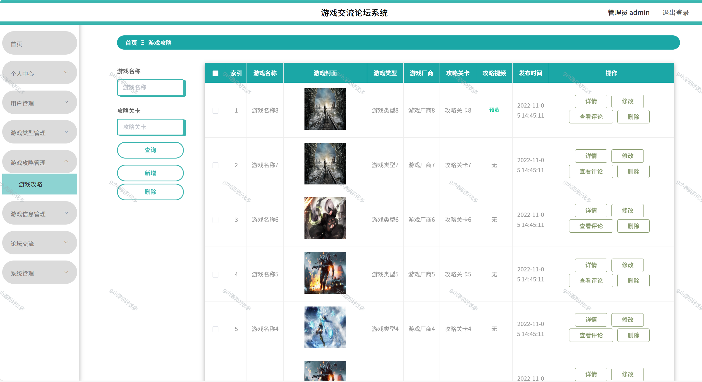
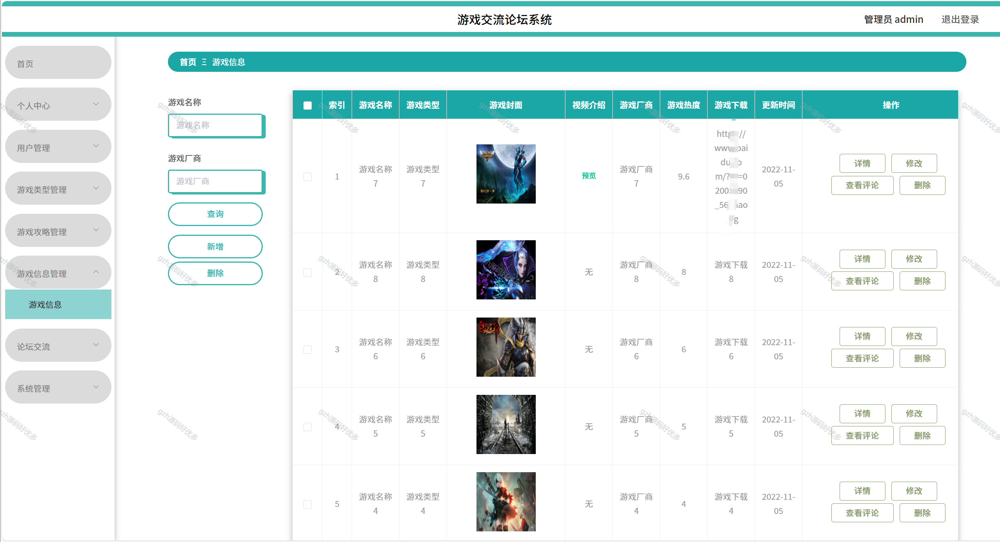
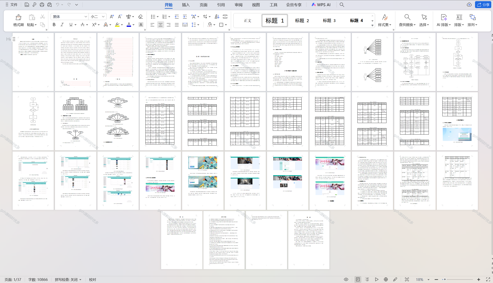

# python085
python085基于Python+Django的游戏交流论坛+LW+PPT
 
## 查看主页获取源码

### 一、关键词
游戏交流社区系统，游戏讨论论坛系统，游戏互动论坛系统

### 二、作品包含
源码+数据库+设计文档万字+PPT+全套环境和工具资源+本地部署教程

### 三、项目技术
前端技术：Vue2.0、Element-ui
后端技术：Python3.7、Django2.0

### 四、运行环境（以下版本亲测，其他版本兼容性请自行测试）
开发工具：PyCharm + VSCODE

数据库：MySQL5.7（最低要5.7版本）

数据库管理工具：Navicat10+

Python：Python3.7

前端Nodejs：14

浏览器：谷歌浏览器

### 五、项目介绍
项目编号：python085

随着网络科技的不断发展以及人们经济水平的逐步提高，网络技术如今已成为人们生活中不可缺少的一部分，而信息管理系统是通过一些数据算法，给用户推荐所需的游戏信息，该技术尤其在游戏领域发挥了巨大的作用，有效地促进了游戏的发展。然而，由于用户量和需求量的增加，信息过载等问题暴露出来，为改善传统线下管理中的不足，本文将提出一游戏辅助和内容更新系统，计算机技术作为近十年来新发展起来的科技，可运用于众多领域中，尤其在游戏管理中，可有效地提升其效率。提高现下游戏辅助和内容更新系统的准确度，同时降低经济波动带来的不良影响，希望本文能对广大学者的研究提供参考。

### 六、运行截图

